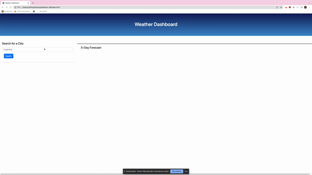
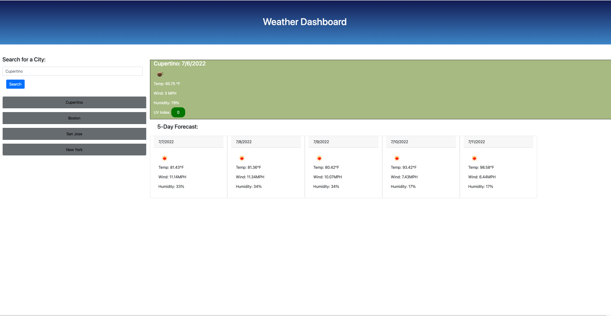

# Weather Dashboard
## Deployment link

https://jeffz98.github.io/Weather-db/

## GIF demo



## Screenshots


### User Information
- [LinkedIn](https://www.linkedin.com/in/jeffrey-zhang-52315522a/)
- [Portfolio](https://jeffz98.github.io/Twilights_Portfolio/)

## Description
This application is weather dashboard that displays the current weather conditions for a city of your choice. It will also inform you of the forecast for the next 5 days in the city.
The user is also able to go to previously searched cities with the search history on the left hand side.
## Code Snippets

```
var latitude = data[0].lat;
var longitude = data[0].lon;
var oneAPIUse = 'https://api.openweathermap.org/data/2.5/onecall/timemachine?lat=' + latitude + '&lon=' + longitude +'&dt='+ currTimeUnix + '&units=imperial&appid=' + APIkey;

fetch(oneAPIUse)      
    .then(function(response){
        return response.json();
    }).then(function(data){
```

In the above code snippet, I am using the latitude and longitude of the city's location in tandence with the curret Unix time, and personal API key to retrieve the weather conditions of the location.


## Technologies Used

HTML, CSS, Bootstrap, JavaScript, and Git

## Credits
- [W3 Schools](https://www.w3schools.com/)
- [Open Weather Map API](https://openweathermap.org/)

## License

MIT License


